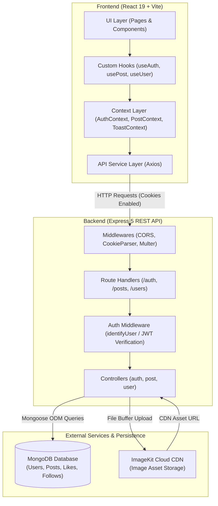

# VibeFeed

Live link: https://vibefeedd.onrender.com

> A modern full-stack visual social feed and creator platform built with React 19, Express 5, Node.js, and MongoDB, featuring secure JWT cookie authentication, ImageKit media storage, and an editorial design system.

---

## Overview

**VibeFeed** is an image-centric social platform engineered for visual creators, photographers, and digital artists to showcase visual work, curate aesthetic feeds, and interact within a streamlined community space. Inspired by editorial portfolios and modern social applications, the platform emphasizes clean typography, dark-mode-first aesthetics, and responsive layout design while minimizing interface clutter.

Architecturally, VibeFeed separates concerns across an Express 5 REST API and a decoupled React 19 Single Page Application (SPA). The application enforces strict data boundaries: user credentials are protected via salted bcrypt hashing and stateless HTTP-only JWT cookies, image uploads are streamed directly into ImageKit cloud storage via in-memory Multer buffers, and relationship operations (likes and follows) are enforced with compound unique indexing at the database level. On the client side, state and networking are structured using a four-layer pattern separating presentation components, custom hooks, centralized context providers, and Axios API services.

---

## Features

### Implemented Features

* **Authentication & Session Handling**:
  * User registration and login with email or username validation.
  * Password encryption via `bcryptjs` (10 salt rounds).
  * Stateless token generation using `jsonwebtoken` delivered via HTTP cookies (1-day expiration).
  * Protected route middleware (`identifyUser`) verifying cookie tokens on private endpoints.
  * Client-side session persistence via `AuthContext` with synchronized `localStorage` caching and automatic `/api/auth/get-me` session revalidation.
  * Dedicated login/registration views with error handling and a "Quick Demo Fill" shortcut for rapid testing.

* **Feed & Visual Posting**:
  * Feed stream aggregating posts with author population, sorted by creation timestamp descending.
  * Feed fallback to high-fidelity starter posts when the database is empty, preventing blank-slate UX.
  * Modal-based post creation with drag-and-drop file upload, instant client-side image preview, caption input with character counter, and quick hashtag shortcuts (`#VibeFeed`, `#VisualArt`, `#Editorial`, etc.).
  * Cloud image hosting via ImageKit Node.js SDK (`@imagekit/nodejs`) streaming from Multer memory storage.
  * In-stream post engagement: double-tap image heart-burst animation, like/unlike toggling, client-side post saving, share-link clipboard copying, and inline comment posting.
  * Dedicated post detail modal with high-resolution imagery, creator metadata, and scrollable comment thread.

* **User Profiles & Follow Graph**:
  * Dynamic user profile views (`/profile` and `/profile/:username`).
  * Tabbed profile navigation for published vibes, saved collections, and liked posts.
  * Follow and unfollow interactions managed through an edge-collection model (`follows`) with compound unique index enforcement.
  * Follower count synchronization and optimistic UI updates.

* **Exploration & Community Discovery**:
  * Explore page (`/explore`) featuring real-time client-side search by keyword or tag, category filtering chips, and a responsive media grid.
  * "Rising Creators" recommendation section with inline follow/unfollow capability.
  * Right-hand desktop discovery panel with persistent search, suggested creators, and trending tags.

* **Notifications & Messaging Interfaces**:
  * Activity center (`/notifications`) categorizing likes, comments, and follows with unread status indicators and "Mark all read" action.
  * Direct messaging interface (`/messages`) featuring conversation lists, active thread switching, online presence indicators, and interactive message sending.

* **Design System & UX**:
  * Custom dark-mode-first tokenized CSS design system (`tokens.css`) with light-mode theme toggle persisted in `localStorage`.
  * Editorial typography powered by *Plus Jakarta Sans*.
  * Reusable UI kit: `Avatar`, `Button`, `Input`, `Modal`, `Skeleton`, `EmptyState`, `ThemeToggle`, and `Toast`.
  * Centralized toast notification system (`ToastContext`) with animated alerts for user actions and API responses.
  * Mobile-responsive navigation bar (`MobileNav`) and top header for smaller viewports.

### Planned / Roadmap Features

* OTP-based registration and password recovery.
* Multi-image carousel uploads per post.
* Server-persisted direct messaging with WebSocket / Socket.io real-time delivery.
* Database-backed notification dispatching triggers.
* Full-text search and pagination / cursor-based infinite scrolling on `/api/posts/feed`.

---

## Tech Stack

| Category | Technology | Version | Purpose |
| :--- | :--- | :--- | :--- |
| **Frontend Framework** | React | `^19.2.0` | UI rendering and component hierarchy |
| **Build Tool & Dev Server** | Vite | `^7.3.1` | Fast HMR and production bundling |
| **Routing** | React Router | `^7.13.1` | Client-side routing and nested layouts |
| **HTTP Client** | Axios | `^1.13.6` | REST API communication with cookie credentials |
| **Styling & Design** | Sass (SCSS) + CSS Custom Properties | `^1.97.3` | Design tokens, animations, and component styling |
| **Icons** | Lucide React | `^1.47.0` | Vector interface icons |
| **Backend Runtime** | Node.js / Express | `^5.2.1` | REST API routing and middleware execution |
| **Database & ODM** | MongoDB / Mongoose | `^9.2.1` | Document storage, schemas, and relational indexing |
| **Authentication** | JSON Web Tokens (`jsonwebtoken`) | `^9.0.3` | Stateless authentication tokens |
| **Password Security** | bcryptjs | `^3.0.3` | One-way cryptographic password hashing |
| **Media Handling** | Multer | `^2.0.2` | In-memory multipart form data parsing |
| **Cloud Storage** | ImageKit SDK (`@imagekit/nodejs`) | `^7.12.1` | Cloud image upload and asset CDN delivery |
| **Utilities** | cookie-parser, cors, dotenv | Latest | Middleware for cookies, cross-origin requests, env loading |

---

## Architecture

VibeFeed is structured as a decoupled client-server architecture:



### Major Architectural Layers

1. **Frontend 4-Layer Architecture**:
   * **UI Layer**: Composable presentation components (`PostCard`, `Sidebar`, `Modal`, `Avatar`) consuming data strictly via props or custom hooks.
   * **Hook Layer (`useAuth`, `usePost`, `useUser`)**: Encapsulates business logic, asynchronous workflows, and local loading/error states.
   * **State / Context Layer (`AuthContext`, `PostContext`, `ToastContext`)**: Manages cross-cutting application state (authenticated user, global feed cache, active modals, and toast queue).
   * **API Service Layer (`auth.api.js`, `post.api.js`, `user.api.js`)**: Configured Axios instances handling base URLs, request headers, and credentials transport.
2. **Backend Controller-Route-Model Pattern**:
   * Express routes define HTTP methods, route parameters, and middleware sequences (`multer` for file uploads, `identifyUser` for token validation).
   * Controllers handle business logic, database queries, and response formatting.
   * Mongoose schemas handle data validation, default values, and index declarations.

---

## Project Structure

```text
VibeFeed/
├── Backend/
│   ├── src/
│   │   ├── config/
│   │   │   └── database.js           # Mongoose connection initialization
│   │   ├── controllers/
│   │   │   ├── auth.controller.js    # Register, login, getMe handler logic
│   │   │   ├── post.controller.js    # Create post, like, feed, and post queries
│   │   │   └── user.controller.js    # Follow and unfollow relationship handlers
│   │   ├── middlewares/
│   │   │   └── auth.middleware.js    # JWT token extraction and verification
│   │   ├── models/
│   │   │   ├── follow.model.js       # Follow edge schema with unique pair index
│   │   │   ├── like.model.js         # Like schema with unique post-user index
│   │   │   ├── post.model.js         # Post schema referencing users
│   │   │   └── user.model.js         # User schema with protected password field
│   │   ├── routes/
│   │   │   ├── auth.route.js         # /api/auth route definitions
│   │   │   ├── post.routes.js        # /api/posts route definitions
│   │   │   └── user.routes.js        # /api/users route definitions
│   │   ├── app.js                    # Express app configuration & middleware
│   │   └── .env                      # Backend local environment variables
│   ├── .env.example                  # Environment variable reference template
│   ├── package.json                  # Backend dependencies and dev scripts
│   └── server.js                     # Server entry point and port listener
│
├── Frontend/
│   ├── public/
│   │   └── vite.svg                  # Vite favicon
│   ├── src/
│   │   ├── components/
│   │   │   ├── layout/               # AppLayout, Sidebar, RightPanel, MobileNav
│   │   │   └── ui/                   # Reusable UI primitives (Avatar, Button, Modal, etc.)
│   │   ├── context/
│   │   │   └── ToastContext.jsx      # Global toast notification context
│   │   ├── features/
│   │   │   ├── auth/                 # Auth context, useAuth hook, API, Login/Register pages
│   │   │   ├── explore/              # Explore page with media search and category filters
│   │   │   ├── messages/             # Direct messaging UI and thread state
│   │   │   ├── notifications/        # Activity center and notification filters
│   │   │   ├── posts/                # PostCard, CreatePostModal, PostDetailModal, Feed page
│   │   │   ├── profile/              # Profile page, stats header, and media tabs
│   │   │   ├── shared/               # Global SCSS styles and animations
│   │   │   └── users/                # useUser hook and follow/unfollow API service
│   │   ├── styles/
│   │   │   └── tokens.css            # Dark/light theme color tokens, spacing, radii
│   │   ├── App.jsx                   # Root component wrapping providers & theme setup
│   │   ├── app.routes.jsx            # React Router browser routing configuration
│   │   └── main.jsx                  # React DOM root render
│   ├── index.html                    # HTML entry point with Plus Jakarta Sans fonts
│   ├── package.json                  # Frontend dependencies and Vite scripts
│   └── vite.config.js                # Vite React plugin configuration
│
└── README.md                         # Project documentation
```

---

## How It Works

### 1. User Registration & Authentication Flow

```text
User Submits Form
      ↓
POST /api/auth/register (or /login)
      ↓
Backend checks duplicate username/email
      ↓
bcrypt hashes password (10 rounds) → User saved to MongoDB
      ↓
Backend signs JWT ({ id, username }) with 1-day expiration
      ↓
Token set in HTTP-Only response cookie ('token')
      ↓
Client stores user metadata in AuthContext & localStorage
      ↓
App redirects to Feed (/)
```

### 2. Post Creation & Media Upload Flow

```text
User selects image & inputs caption in CreatePostModal
      ↓
Frontend appends File and caption to FormData
      ↓
POST /api/posts (multipart/form-data)
      ↓
Multer intercepts file into memory buffer (no local disk writes)
      ↓
ImageKit Node SDK uploads buffer to "cohort-2-insta-clone" folder
      ↓
ImageKit returns hosted CDN image URL
      ↓
Mongoose saves post document { caption, imgUrl, user: req.user.id }
      ↓
Backend returns HTTP 201 with populated post object
      ↓
Client prepends new post to PostContext feed optimistically
```

### 3. Feed Retrieval & Interaction Flow

```text
User loads Feed (/)
      ↓
GET /api/posts/feed (Token verified by identifyUser middleware)
      ↓
Mongoose queries posts, populates author info, sorts by _id descending
      ↓
If database has posts → Render real post cards
If database is empty → Render high-fidelity fallback starter posts
      ↓
User clicks Like or double-taps image
      ↓
POST /api/posts/like/:postId
      ↓
Backend toggles Like record (creates if new, deletes if already liked)
      ↓
UI updates like state and counter with heart-burst animation
```

---

## Installation & Setup

### Prerequisites

* **Node.js**: v18.0.0 or higher recommended.
* **npm**: v9.0.0 or higher.
* **MongoDB**: A running local MongoDB instance (`mongodb://localhost:27017`) or a MongoDB Atlas connection string.
* **ImageKit Account**: An ImageKit account to obtain an `IMAGEKIT_PRIVATE_KEY` for media uploads.

### 1. Clone the Repository

```bash
git clone https://github.com/naitik-work/VibeFeed.git
cd VibeFeed
```

### 2. Configure Backend Environment Variables

Navigate to the `Backend` directory and create your `.env` file based on `.env.example`:

```bash
cd Backend
cp .env.example .env
```

Open `.env` and fill in your values (see [Environment Variables](#environment-variables)).

### 3. Install Dependencies

Install dependencies for both the Backend and Frontend:

```bash
# Install Backend dependencies
cd Backend
npm install

# Install Frontend dependencies
cd ../Frontend
npm install
```

---

## Environment Variables

### Backend (`Backend/.env`)

| Variable | Required | Default / Example | Purpose |
| :--- | :--- | :--- | :--- |
| `MONGO_URI` | **Yes** | `mongodb://localhost:27017/vibefeed` | MongoDB connection URI (local or MongoDB Atlas) |
| `JWT_SECRET` | **Yes** | `your_super_secret_jwt_key` | Secret string used to sign and verify authentication JWTs |
| `IMAGEKIT_PRIVATE_KEY` | **Yes** | `private_xxxxxxxxxxxxxxxxxxxx` | ImageKit private key for uploading images via the SDK |
| `PORT` | No | `3000` | Port on which the Express server will listen |

> **Note:** The backend server loads `.env` files automatically from both the `Backend` root directory and `Backend/src/.env`.

---

## Running the Project

Run both servers concurrently in separate terminal windows:

### Terminal 1 — Start the Backend Server

```bash
cd Backend
npm run dev
```

* Backend server runs at: `http://localhost:3000`
* Console should display:
  ```text
  Server is running at port 3000.
  Connected to MongoDB successfully!
  ```

### Terminal 2 — Start the Frontend Development Server

```bash
cd Frontend
npm run dev
```

* Frontend dev server runs at: `http://localhost:5173`
* Open `http://localhost:5173` in your browser.

---

## API Documentation

All routes under `/api/posts` and `/api/users`, as well as `/api/auth/get-me`, require the client to supply a valid JWT `token` cookie set upon login or registration.

### Authentication Endpoints (`/api/auth`)

| Method | Endpoint | Description | Auth Required | Request Body / Parameters |
| :--- | :--- | :--- | :---: | :--- |
| `POST` | `/api/auth/register` | Registers a new user account and sets JWT cookie | No | `{ username, email, password, bio?, profile_image? }` |
| `POST` | `/api/auth/login` | Authenticates existing user and sets JWT cookie | No | `{ username?, email?, password }` |
| `GET` | `/api/auth/get-me` | Fetches authenticated user's profile | **Yes** | None (reads cookie) |

### Post Endpoints (`/api/posts`)

| Method | Endpoint | Description | Auth Required | Request Parameters / Body |
| :--- | :--- | :--- | :---: | :--- |
| `GET` | `/api/posts/feed` | Fetches all posts sorted by creation date descending | **Yes** | None |
| `POST` | `/api/posts/` | Creates a new post with cloud image upload | **Yes** | `multipart/form-data`: `image` (file), `caption` (text) |
| `GET` | `/api/posts/` | Retrieves all posts authored by the logged-in user | **Yes** | None |
| `GET` | `/api/posts/details/:postId` | Retrieves specific post details (validates ownership) | **Yes** | URL parameter `postId` |
| `POST` | `/api/posts/like/:postId` | Toggles like/unlike on a target post | **Yes** | URL parameter `postId` |

### User & Relationship Endpoints (`/api/users`)

| Method | Endpoint | Description | Auth Required | Request Parameters / Body |
| :--- | :--- | :--- | :---: | :--- |
| `POST` | `/api/users/follow/:username` | Creates a follow relationship toward target user | **Yes** | URL parameter `username` |
| `POST` | `/api/users/unfollow/:username` | Deletes existing follow relationship | **Yes** | URL parameter `username` |

---

## Database Design & Data Models

VibeFeed uses MongoDB via Mongoose schemas designed for referential integrity and query efficiency:

### 1. User Schema (`users` collection)

* `username` (String, required, unique): Unique creator handle.
* `password` (String, required, `select: false`): Hashed password string. Excluded from general queries for security; selectively loaded via `.select("+password")` only during login verification.
* `email` (String, required, unique): Unique email address.
* `bio` (String): Short creator biography.
* `profile_image` (String): Avatar URL (defaults to hosted ImageKit fallback image).
* `followers` / `following`: Array of `ObjectId` references to `users`.

### 2. Post Schema (`posts` collection)

* `caption` (String, default: `""`): Post caption text and hashtags.
* `imgUrl` (String, required): Public CDN URL returned by ImageKit.
* `user` (`ObjectId`, ref: `"users"`, required): Direct reference to the post author.

### 3. Like Schema (`likes` collection)

* `post` (`ObjectId`, ref: `"posts"`, required): The liked post ID.
* `user` (String, required): The username of the liker.
* `timestamps`: Automatically records `createdAt` and `updatedAt`.
* **Compound Index**:
  ```javascript
  likeSchema.index({ post: 1, user: 1 }, { unique: true });
  ```
  Guarantees idempotency at the database level: a user cannot register duplicate likes on the same post.

### 4. Follow Schema (`follows` collection - Edge Pattern)

* `follower` (String): The username initiating the follow.
* `followee` (String): The target username being followed.
* `status` (String, enum: `["pending", "accepted", "rejected"]`, default: `"pending"`).
* `timestamps`: Automatically records timestamps.
* **Compound Index**:
  ```javascript
  followSchema.index({ follower: 1, followee: 1 }, { unique: true });
  ```
  Prevents duplicate follow records and enforces relational consistency.

---

## Authentication & Security

* **Password Hashing**: Passwords are never stored in plaintext. They are hashed using `bcryptjs` with an industry-standard work factor of 10 rounds before saving to MongoDB.
* **Stateless Token Authentication**: Authentication utilizes JSON Web Tokens (`jsonwebtoken`) signed with a server-side secret (`JWT_SECRET`) and a 1-day expiration duration.
* **Credential Transport via Cookies**: JWT tokens are transmitted via HTTP cookies (`token`), enabling seamless session handling with Axios (`withCredentials: true`).
* **Route Protection Middleware**: The `identifyUser` middleware intercepts requests, validates the signature and expiration of the token, and attaches the decoded user identity (`req.user = { id, username }`) to the request object. Unauthenticated or expired requests are rejected with `401 Unauthorized`.
* **Defense in Depth Query Sanitization**: The user schema configures `select: false` on the password attribute, preventing accidental leakage in JSON serialization, query logging, or endpoint responses.
* **CORS Origin Restriction**: The Express server explicitly configures CORS for `http://localhost:5173` with credentials support enabled, preventing unauthorized cross-origin access.

---

## Challenges & Technical Highlights

* **Compound Unique Indexing for Distributed Concurrency**:
  Handling likes and follows via separate edge collections (`likes`, `follows`) with compound unique indexes (`{ post: 1, user: 1 }` and `{ follower: 1, followee: 1 }`) eliminates duplicate records caused by rapid client-side clicks without requiring distributed transaction locks.
* **Buffer-to-Cloud Asset Pipeline**:
  File uploads avoid persisting temporary files to the local web server filesystem. Instead, Multer holds image uploads in memory (`memoryStorage()`) and streams the buffer directly to ImageKit using `toFile(Buffer.from(req.file.buffer), "file")`. This keeps the backend server stateless and cloud-ready.
* **4-Layer Frontend Separation of Concerns**:
  By enforcing a distinct separation between UI components, custom hooks (`useAuth`, `usePost`, `useUser`), centralized Context stores, and dedicated Axios API services, UI components contain zero direct network calls or state-mutation logic.
* **Dual-State Resilience (Database + Fallback Data)**:
  To provide an engaging user experience out-of-the-box upon fresh database clones, the feed gracefully displays high-fidelity fallback creator starter posts if the database feed query returns an empty collection, while seamlessly accepting new user-generated posts.
* **Tokenized Theming System**:
  Implemented using native CSS custom properties (`tokens.css`) and SCSS, supporting persistent dark and light modes with smooth transitions and zero layout shifts.

---

## Future Improvements

* [ ] **Pagination & Infinite Scroll**: Implement cursor-based pagination on `/api/posts/feed` to optimize feed query performance under heavy post volume.
* [ ] **WebSocket Real-Time Messaging**: Upgrade the direct messaging interface (`/messages`) from optimistic local state to persistent Socket.io / WebSocket delivery.
* [ ] **OTP Email Verification**: Add email-based one-time password verification during registration.
* [ ] **Bookmark / Save Collection Backend**: Move post saves from local UI collection state to a dedicated MongoDB collection.
* [ ] **Image Transformations**: Leverage ImageKit dynamic query parameters for automated thumbnail resizing and WebP optimization.

---

## Author

**Naitik Chitransh**

* **GitHub**: [@naitik-work](https://github.com/naitik-work)
* **Repository**: [https://github.com/naitik-work/VibeFeed](https://github.com/naitik-work/VibeFeed)
